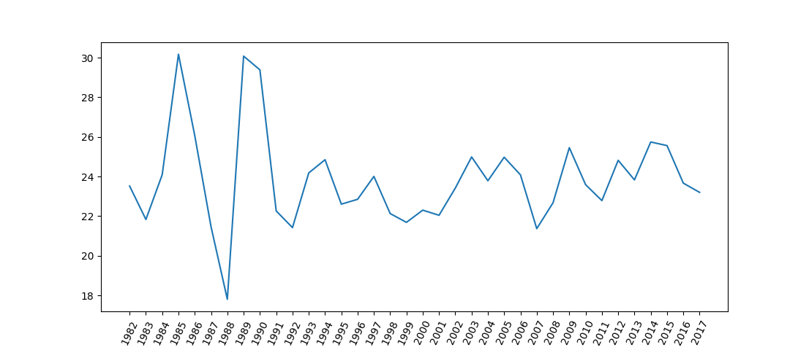
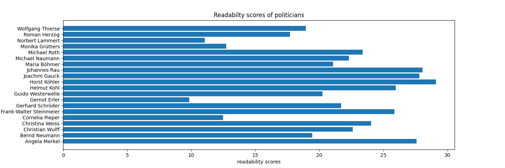

# Readability scores
Implementation of the Flesch Kincaid Readability ease and grade score for German and English.

## Ressources
The algorithm to count the syllables of English words is from [Eayd.in](https://eayd.in/?p=232).
The algorithms for Reading Ease and Reading Grade are from [Flesch and Kincaid](https://en.wikipedia.org/wiki/Flesch%E2%80%93Kincaid_readability_tests)

## Technologies
Build with Python: 3.7

## Setup
Download this repo.  
In ```readability/bin/calculator.py``` are two functions:  
```get_reading_level(text, lang)```  calculates the reading level.  
```get_reading_ease(text, lang)``` calculates the reading ease.  
The ```lang``` can either be ```'en'``` (default) for English or ```'de'``` for German.  

Please note that the test cases only cover German test cases and that this is an implementation of the original Flesch-Kincaid readability score.
Not one that was adapted for the German language such as [the Wiener Sachtext Formel](https://de.wikipedia.org/wiki/Lesbarkeitsindex#Wiener_Sachtextformel).

For testing please call `python -m unittest discover` in  `readability/bin`.

 
## Code Samples

Code for these plots can be found at `plots/political_speeches.py`.

The readability of speeches from German ploticians per year:



The readability of speeches from German ploticians per politician:



data from:
    https://adrien.barbaresi.eu/corpora/speeches/


